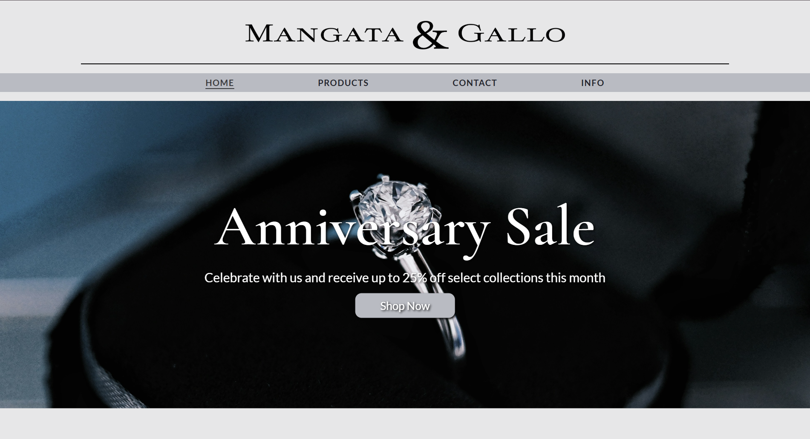
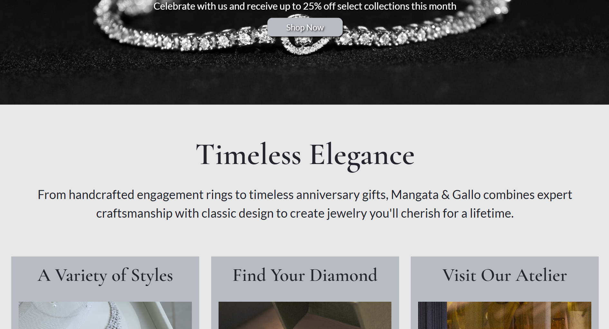
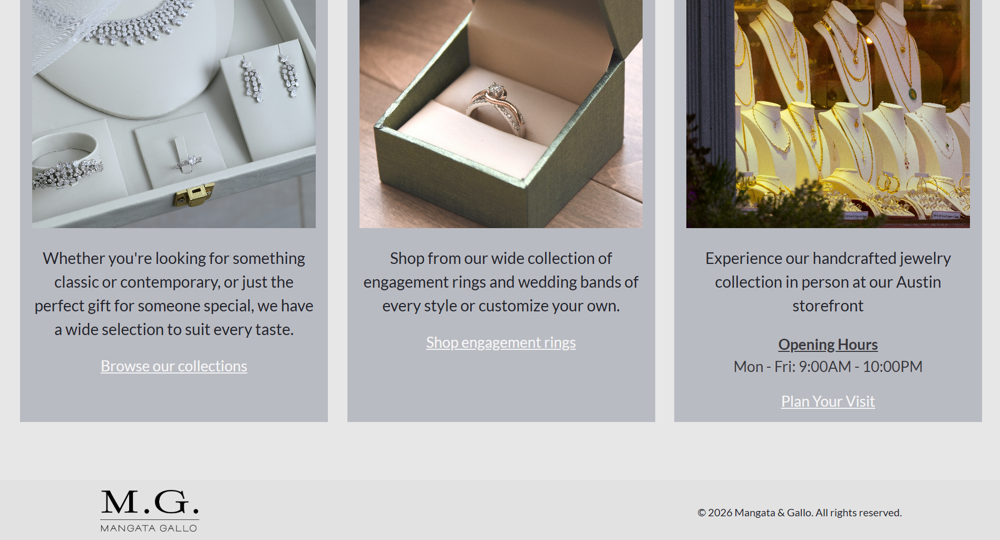
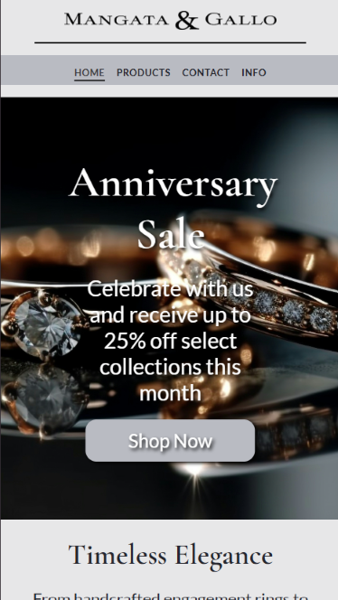
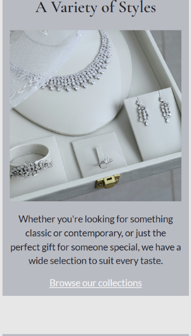

# Mangata & Gallo Jewelry Website

A responsive website designed for **Mangata & Gallo**, a luxury jewelry company specializing in engagement rings, wedding bands, and aniversary gifts.

The website showcases the brand's elegant style, product offerings, and story while providing users with an immersive browsing experience.

## Preview

### Desktop

### Mobile
 

## Features

- Responsive layout that adapts to desktop, tablet, and mobile screens
- Hero banner with an automatic image slideshow
- Promotional banner highlighting special offers
- Navigation menu with interactive hover effects
- Product and service cards using CSS Grid
- Brand-focused content highlighting craftsmanship
- Footer with company information and branding

## Technologies Used

- HTML5
- CSS3
- CSS Grid
- CSS Flexbox
- CSS Animations
- Google Fonts

## Design

The website uses a luxury-inspired design featuring:

- Elegant serif typography for headings
- Clean sans-serif typography for readability
- Neutral colors and spacious layouts
- Large imagery to showcase jewelry pieces

## Future Improvements

- Add JavaScript functionality for image carousel controls
- Add product filtering and search features
- Create additional pages for products, contact, info, and checkout
- Add accessibility improvements and form validation

## Image Credits

Images used in this project were sourced from:
- Pexels (https://www.pexels.com/)
- Unsplash (https://unsplash.com/)

All images are used for demonstration purposes. Credit belongs to the original photographers and creators.

## Author

Created by Takia Tahmid
